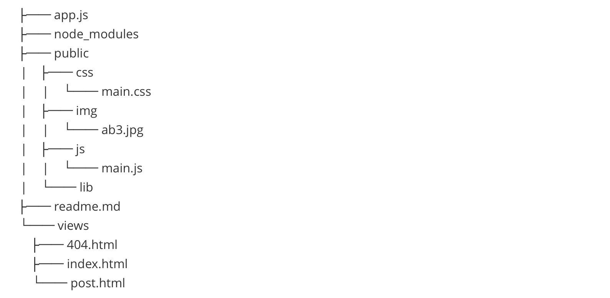
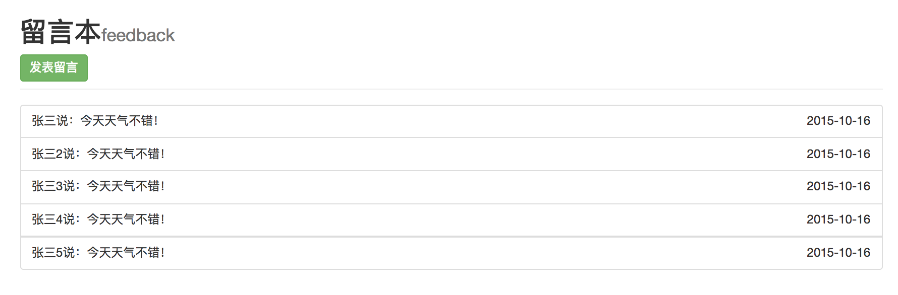
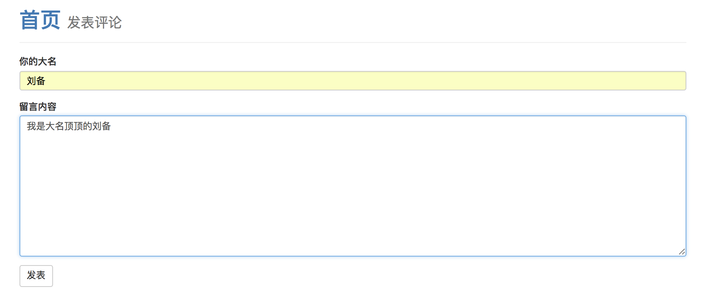
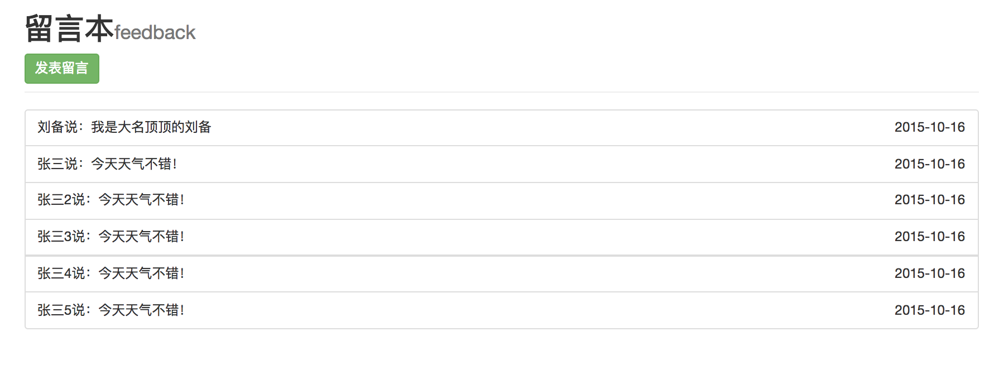

# 留言本（express搭建的服务器）

## 启动
### 1.命令行
```node app.js```
### 2.浏览器
localhost:3000/students

## 技术栈

- node
- express——框架
- express-art-tempalte——框架模版
- art-template——模版
- nodemon——解决重启服务器的麻烦
- body-parser——获取post请求内容

## 实现功能

- 评论页评论后跳转到首页
- 评论追加到首页

## 项目结构



## 项目截图

   - ### 首页

   - ### 评论页

   - ### 评论后的首页
  


